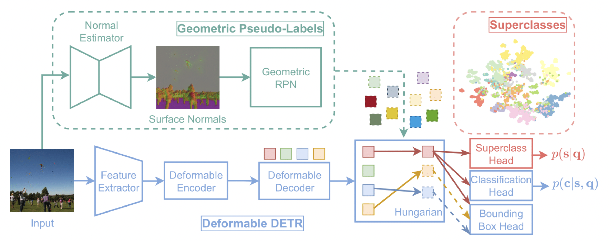

# O1O: Grouping Known Classes to Identify Unknown Objects as Odd-One-Out (ACCV 2024 Oral)

[Mısra Yavuz](https://scholar.google.com/citations?user=lfU8AYUAAAAJ&hl=en), [Fatma Güney](https://mysite.ku.edu.tr/fguney/)


[[`paper`](https://openaccess.thecvf.com/content/ACCV2024/papers/Yavuz_O1O_Grouping_of_Known_Classes_to_Identify_Unknown_Objects_as_ACCV_2024_paper.pdf)]
[[`supplementary`](https://openaccess.thecvf.com/content/ACCV2024/supplemental/Yavuz_O1O_Grouping_of_ACCV_2024_supplemental.pdf)]
[[`bibtex`](#cite)]
[[`arxiv`](https://arxiv.org/abs/2410.07514)]
[[`website`](https://kuis-ai.github.io/O1O/)]
[[`slides`](https://drive.google.com/file/d/1ja7PgQRmTCx6GwYnMEwU6gz_iYZZBUhd/view?usp=sharing)]

### ✨ highlights 

- O1O was selected for an **oral presentation** at [ACCV2024](https://accv2024.org/) and shortlisted as a [best paper award finalist](https://accv2024.org/awards/)! 🎉

<div align="center">
  
</div><br/>

📝 **TL;DR**: O1O shapes the representation space by encouraging queries of similar classes to group together, allowing us to identify odd-one-out queries as unknown objects.


### ⚙️ environment setup

setup a new environment by using the python and cuda versions available on your machine

```bash
conda create --name o1o python==3.12
conda activate o1o
pip install torch==2.5.1 torchvision==0.20.1 --index-url https://download.pytorch.org/whl/cu124
pip install -r requirements.txt 
```

download the feature extraction backbone
```bash
wget https://dl.fbaipublicfiles.com/dino/dino_resnet50_pretrain/dino_resnet50_pretrain.pth
```

compile CUDA operators
```bash
cd ./models/ops
sh ./make.sh
# unit test (might fail after a point depending on your gpu memory)
python test.py
```


### 🗂️ dataset setup  

1. download coco 2017, pascal voc 2007 and 2012 datasets with annotations. 
```bash
wget http://images.cocodataset.org/zips/train2017.zip  
wget http://images.cocodataset.org/zips/val2017.zip 
wget http://images.cocodataset.org/annotations/annotations_trainval2017.zip 

wget http://host.robots.ox.ac.uk/pascal/VOC/voc2007/VOCtrainval_06-Nov-2007.tar 
wget http://host.robots.ox.ac.uk/pascal/VOC/voc2012/VOCtrainval_11-May-2012.tar 
wget http://host.robots.ox.ac.uk/pascal/VOC/voc2007/VOCtest_06-Nov-2007.tar
```
2. unzip and untar downloaded files. 
3. run `coco2voc.py` to convert coco json annotations to xml format.
4. move all annotations under `OWOD/Annotations` and all images under `OWOD/JPEGImages`.
   

### 📌 <a name="cite"></a> cite O1O

if you use O1O in your research, please cite our work! 

```bibtex
@InProceedings{Yavuz_2024_ACCV,
  author    = {Yavuz, M{\i}sra and G\"uney, Fatma},
  title     = {O1O: Grouping of Known Classes to Identify Unknown Objects as Odd-One-Out},
  booktitle = {Proceedings of the Asian Conference on Computer Vision (ACCV)},
  month     = {December},
  year      = {2024},
  pages     = {614-629}
}
```
